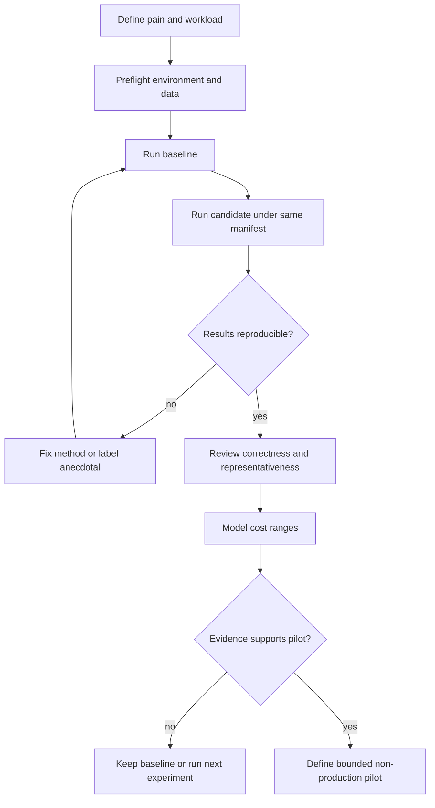

# Wireframes

These are proposed product surfaces, not current implementation. Numeric content is placeholder-only.

## 1. Decision-lab preflight

```text
┌──────────────────────────────────────────────────┐
│ Analytics Modernization Lab                     │
│ Goal: test a representative workload, not prove │
│ a universal winner.                             │
├──────────────────────────────────────────────────┤
│ ✓ Python [detected version]                     │
│ ✓ Docker running                               │
│ ! Dataset missing                              │
│   [Use synthetic fixture] [Dataset instructions]│
│ ○ Local model optional                         │
│                                                  │
│ Data stays local. Generated SQL is read-only.   │
│ [View assumptions]              [Start lab]      │
└──────────────────────────────────────────────────┘
```

Preflight separates required and optional dependencies and never uploads data silently.

## 2. Workload and evidence dashboard

```text
┌──────────────────────────────────────────────────┐
│ Decision: CSV baseline vs Parquet candidate     │
│ Evidence status: 4 reproducible • 1 missing     │
├──────────────────────────────────────────────────┤
│ Workload class     Runs   Confidence   Compare   │
│ Full read          3      medium       [open]    │
│ Column projection  3      medium       [open]    │
│ Time filter        3      medium       [open]    │
│ Concurrency        0      GAP          [design]  │
├──────────────────────────────────────────────────┤
│ Missing: production-like concurrency evidence   │
│ [Run selected] [Export decision brief]          │
└──────────────────────────────────────────────────┘
```

Confidence reflects evidence representativeness, not “percent likely to succeed.”

## 3. Query journey — happy and inspectable

```text
┌──────────────────────────────────────────────────┐
│ Ask about the demo dataset                      │
│ > [synthetic business question]                 │
│ [Generate SQL]                                  │
├──────────────────────────────────────────────────┤
│ SQL (read-only)                    [Copy] [Edit] │
│ SELECT …                                        │
│ Safety: passed • Tables: 2 • Partitions: 1/…    │
│ [Run]                                           │
├──────────────────────────────────────────────────┤
│ Results [table]                                 │
│ Generation [time] Query [time] Rows [count]     │
│ [Plain-language summary] [View EXPLAIN]         │
└──────────────────────────────────────────────────┘
```

SQL remains visible before execution; natural-language summary never replaces raw result inspection.

## 4. Empty, loading, error, and edge states

```text
EMPTY RUNS                     LOADING
┌───────────────────────┐      ┌───────────────────────┐
│ No benchmark runs     │      │ Running 2 of 6…      │
│ Claims remain unproven│      │ Current: filtered read│
│ [Run baseline]        │      │ [Cancel safely]       │
└───────────────────────┘      └───────────────────────┘

ENGINE ERROR                   EDGE: INVALID SQL
┌───────────────────────┐      ┌───────────────────────┐
│ Trino not ready       │      │ Query not executed    │
│ Data is unchanged.    │      │ Unknown column […]    │
│ [Diagnostics] [Retry] │      │ [Revise] [Show schema]│
└───────────────────────┘      └───────────────────────┘

EDGE: NON-REPRESENTATIVE
┌──────────────────────────────────────────────────┐
│ Result completed, but workload coverage is LOW. │
│ Missing: concurrency, update cadence, larger set │
│ [Record limitation] [Design next experiment]    │
└──────────────────────────────────────────────────┘
```

## 5. Decision flow



## Accessibility and responsive notes

- Terminal and web concepts provide text equivalents; no insight relies on chart color.
- Tables support semantic headers, horizontal overflow, and downloadable structured data.
- Long SQL wraps or scrolls without stealing keyboard focus; syntax color is decorative.
- Loading has text progress and cancellation; no time-only interaction.
- Narrow layouts stack evidence cards while preserving run → claim → limitation order.
- Error announcements are concise, persistent, and linked to diagnostics.
- Motion is optional; 200% zoom and high-contrast modes preserve controls and warnings.
